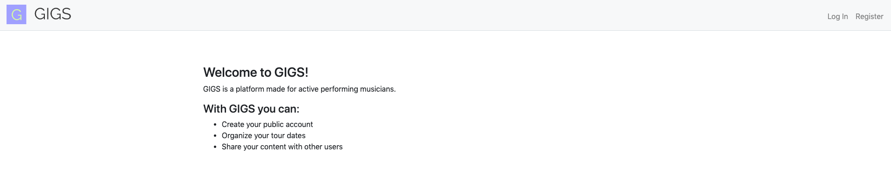
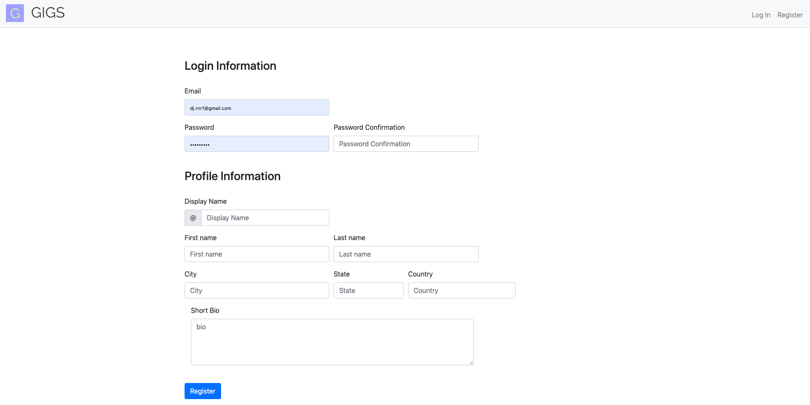
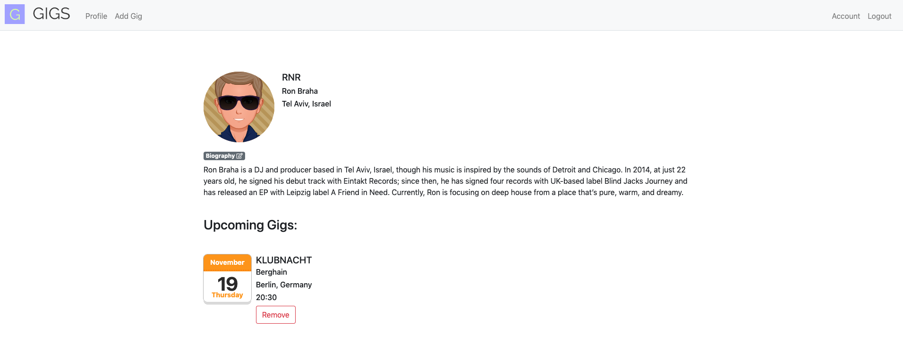
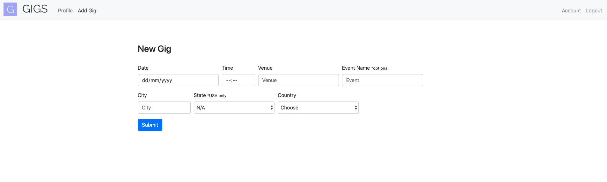
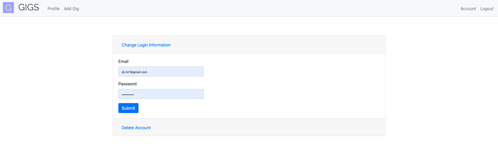

# GIGS
a web app for creating and managing an upcoming gigs page of an active artist.

Created in a Python-Flask environment with PostgreSQL.

Demo: https://rons-gigs.herokuapp.com/

## Table Of Contents
- [GIGS](#gigs)
  - [Table Of Contents](#table-of-contents)
  - [Motivation](#motivation)
  - [Screenshots](#screenshots)
    - [Landing page](#landing-page)
    - [Registration Form](#registration-form)
    - [Profile](#profile)
    - [add-gig](#add-gig)
    - [account management](#account-management)
  - [Tech stack](#tech-stack)
  - [How to use?](#how-to-use)

## Motivation
As an indie electronic artist myself i find it very important to push your content to social media, so i decided to make a simple platform that
will let you create your public artist page, include your upcoming gigs and any other related content and share them with the world.

## Screenshots

### Landing page

### Registration Form
enter your profile and login information to get started.

### Profile
manage your profile info and your tour dates.

### add-gig
enter your upcoming gig info so it could be added to your list. 

### account management
change your login information / deactivate your account.

## Tech stack
- Python 3
- Flask
- Jinja
- Werkzeug
- PostgreSQL
- psycopg2
- Javascript
- Bootstrap
- memegen

## How to use?
1. create an account
2. manage your artist profile
3. share your content with the world

© [Ron Braha]()